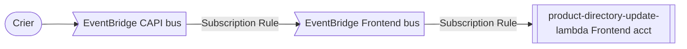

# product-directory-update-lambda

This lambda is responsible for populating and updating the list of products stored in the `ProductDirectoryPricingTable` DynamoDB table and the product-article relationship in `ProductDirectoryProductArticleTable`. It does not handle any pricing information. The lambda is written in Typescript.

## Architecture

This lambda listens to [Crier](https://github.com/guardian/crier) events in order to find products that have been added to or removed from articles. These events are forwarded from the CAPI AWS account to the Frontend account, where this lambda lives, via an Eventbus.



The events from Crier are filtered by `detailType` - only those events with `itemType` `"content"` trigger the lambda.

Once an event hits the lambda it needs to be deserialized from Thrift format. If it is of `eventType` `"RETRIEVABLEUPDATE"` we must make a separate call to CAPI to receive the whole message.

The Crier event bus is also used to perform backfill operations. These events mimic the RetrievableUpdate format in order to fetch the content from CAPI.

### Processing updates

There are two possible things that can happen when an update is received:

1. There is a new product to be added to the database
2. A product should be removed from the database

We use a soft delete to remove products by marking entries with a field `removed` and a timestamp `removedDate`.

If a product is remove from an article it is marked as removed from the `ProductDirectoryProductArticleTable`, if that is its only occurence then it is marked removed from `ProductDirectoryPricingTable`.

## Dev setup

Run the tests with

```
npm run test
```
